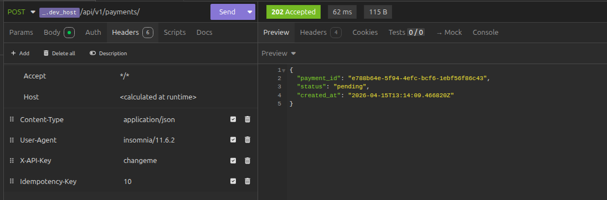
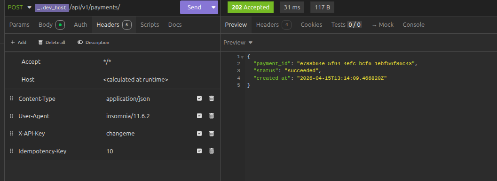
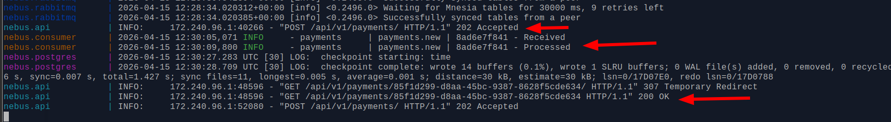
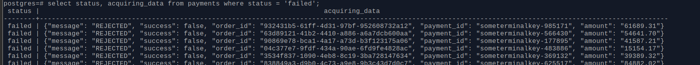

# Payment Service

Сервис обработки платежей на базе FastAPI с паттерном Outbox и очередью RabbitMQ.

## Реализация:
- Вебхук запрос - сделал Mock, просто лог запроса

- `Эмулирует обработку платежа (2-5 сек, 90% успех, 10% ошибка)` - реализовал 10% ошибки в виде REJECTED статуса, 
если необходимо такой кейс также отправлять в DLQ то можно добавить также выброс исключения после проставления статуса.

- DLQ обработчик просто лог, т.к. указано `Один consumer`. При необходимости конкретных действий можно реализовать дополнительную логику.


## Запуск

### 1. Создать `.env` файл

### 2. Запустить сервисы

```
make down ; make build ; make up
```

### 3. Применить миграции

```
make db_head
```

### 4. Создать миграцию

```
make makemigrations MSG="message"
```

### RabbitMQ Management UI

Доступен на `http://localhost:15672`


## Результаты

### Создание платежа


### Дубликат


### Получение платежа


### Успешные обработки


### Под нагрузкой

- При отправке 10к запросов ожидаемо получаем таймауты БД
Пример:
`nebus.consumer  | 2026-04-15 12:44:44,873  payments     | payments.new | aa1b632341 - TimeoutError: QueuePool limit of size 5 overflow 10`

после чего ошибки попадают в DLQ
Пример:
`nebus.consumer  | DLQ payment bbd13265-1bed-4264-bd22-ada221e914ab, msg.headers={'x-death': [{'count': 1, 'reason': 'rejected', 'queue': 'payments.new', 'time': datetime.datetime(2026, 4, 15, 12, 44, 45, tzinfo=datetime.timezone.utc), 'exchange': '', 'routing-keys': ['payments.new']}], 'x-first-death-exchange': '', 'x-first-death-queue': 'payments.new', 'x-first-death-reason': 'rejected', 'x-last-death-exchange': '', 'x-last-death-queue': 'payments.new', 'x-last-death-reason': 'rejected'}
`

- При `REJECTED` ответе проставляется статус failed:
